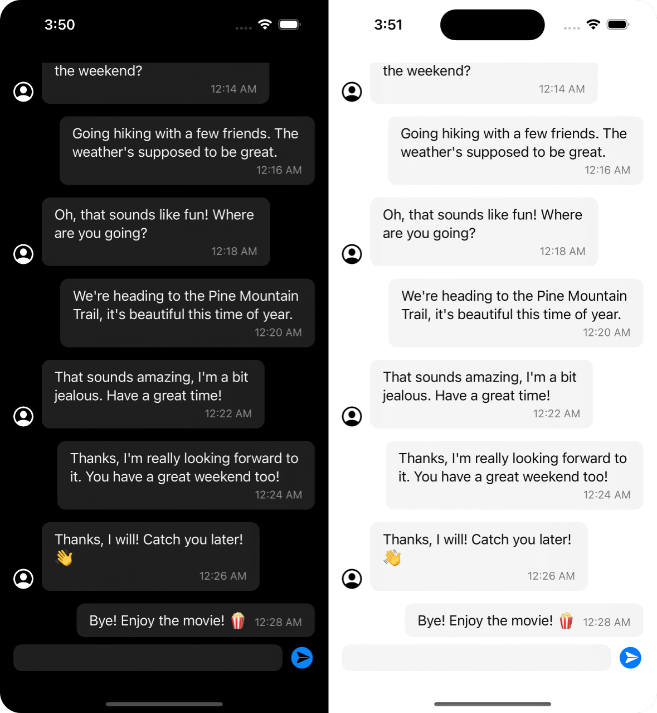
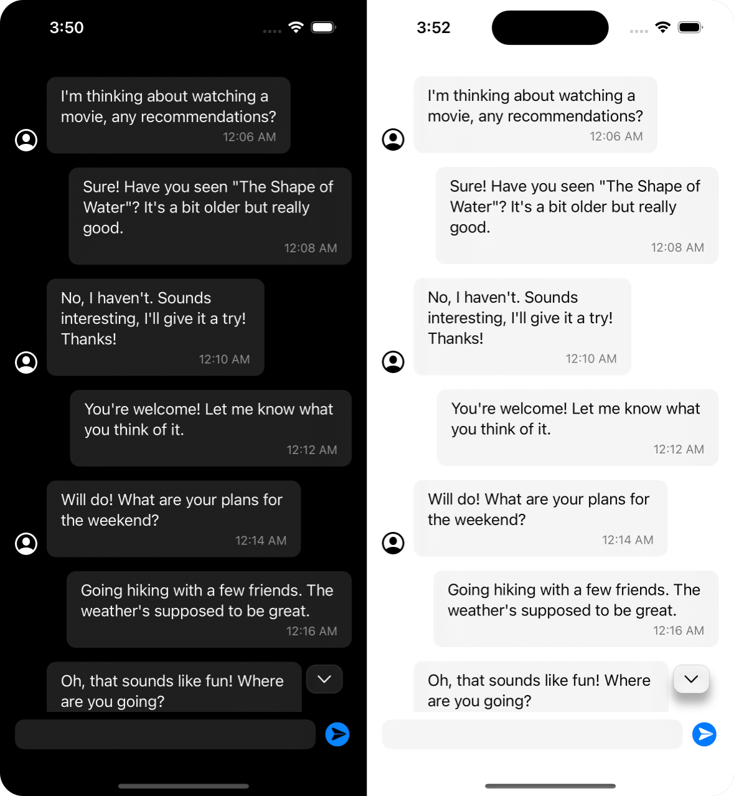

# QSChatView
> A beautiful data-driven chat view for iOS and macOS.

|   |   |
| - | - |
|  |  |

## Install
### SwiftPM

```
https://github.com/quintschaf/qschatview.git
```

## Features

- Fully interactive, data-driven chat view
- Various customization options
- Supports light and dark mode
- Works on iOS, macOS and Catalyst

## Usage

### Basic
> A very basic example with a single chat participant and message.

```swift
import SwiftUI
import QSChatView

struct MyChatView: View {
    // Instantiate a `ChatController` with some initial messages
    @StateObject var controller = ChatController(messages: [
        ChatMessage(from: .me, content: .text("Hello world")),
    ])

    var body: some View {
        // Render the chat view with our controller
        QSChatView(controller).padding()
    }
}
```

### Advanced
> A more advanced example with a modified config, multiple participants
> and a custom chat backend.

```swift
import SwiftUI
import QSChatView

class MyChatData: ObservableObject {
    @Published var controller: ChatController
    @Published var chatPartner: ChatParticipant

    init() {
        // Use default chat config as a starting point
        let config = ChatConfig.default

        // Change settings to your liking
        config.showTextField = true
        config.showTimestamps = false
        config.scrollingBehavior = .adaptive

        /*
         * In this example we specify a fixed set of initial messages.
         *
         * In a real-world application, you would probably load messages
         * from a server or database, or restore them from a local cache.
         */
        let messages: [ChatMessage] = [
            ChatMessage(from: .me, content: .text("Hey John, are you there?"))
        ]

        // Create a chat controller with our messages and config
        self.controller = ChatController(messages: messages, config: config)

        // Create a chat partner
        self.chatPartner = ChatParticipantBuilder().withName("John Doe").build()
    }

    // This is meant as an example on how to interact with the chat controller.
    // It also serves as an introduction to the `ChatMessagePromise` API.
    func startMessageTimer() {

        // Run this block every 5 seconds
        Timer.scheduledTimer(withTimeInterval: 5, repeats: true) { _ in

            // Add a temporary message with a typing indicator.
            // In this case, John Doe is shown as typing.
            let messagePromise = self.controller.sendPromise(from: self.chatPartner)

            // Wait 2 seconds before resolving the promise
            DispatchQueue.main.asyncAfter(deadline: .now() + 2) {

                // Resolve the promise with the actual message
                messagePromise.fulfill(withContent: .text("Hello from John!"))

                // In the case that John stops typing without sending
                // a message, we can use `messagePromise.reject()` instead.
            }
        }
    }
}

struct MyChatView: View {
    @StateObject var chat = MyChatData()

    // Called when the user sends a message through the chat view
    func handleMessageSent(_ message: String) {
        /*
         * Messages are added to the controller before this callback is called.
         *
         * We can do additional processing here, such as sending the message
         * to a server, logging it, updating statistics, and so on.
         *
         * In this example, we just print the message to the console.
         */
        print("User sent message: \(message)")
    }

    var body: some View {
        // Render the chat view with our controller and callback
        QSChatView(chat.controller, onMessageSent: handleMessageSent)
            .padding()
            .onAppear { chat.startMessageTimer() }
    }
}
```